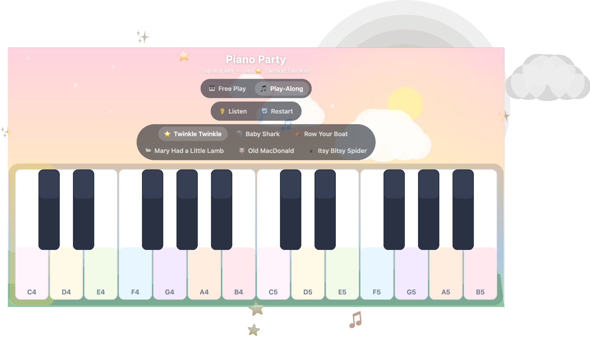

# Tingle

A tiny, whimsical collection of on-screen toys for small hands.

**Live:** [pedrodiogo.com/Tingle](https://pedrodiogo.com/Tingle/)



## What it does

Tingle is a set of gentle, tap-anywhere "toys" designed for toddlers and young kids. No goals, no scoring, no ads, no timers — just sounds and pictures that react when you touch the screen. Everything runs in the browser and installs as a PWA for offline play on a tablet or phone.

Toys currently included:

- **🫧 Bubbles** — colourful bubbles drift across a pastel sky. Tap one and it pops with a chime in a C-major pentatonic scale, so any combination of pops sounds pleasant.
- **🎹 Piano** — a real two-octave piano (C4–B5) with two modes:
  - **Free Play** — each key plays its true pitch. Great for experimenting with real notes.
  - **Play-Along** — pick a nursery song (Twinkle Twinkle, Baby Shark, Row Your Boat, Mary Had a Little Lamb, Old MacDonald, Itsy Bitsy Spider) and every key tap plays the next note of the melody. Kids feel the satisfaction of "playing" a real song without having to hit the right keys. A "Listen" button plays the whole melody with proper tempo so they can learn the tune first.

Switch between toys via the pill at the bottom. Last-used toy is remembered on reload.

## Who it's for

Very young children (roughly 1–5 years old) and the adults playing alongside them. The design goals:

- **Safe to hand over** — no menus to accidentally exit into, no network requests after first load, no ads, no in-app purchases, no tracking.
- **Forgiving input** — large hit targets, no "wrong" interactions, every touch produces a pleasing reaction.
- **Musical consonance** — bubble pitches and piano play-along mean a child mashing the screen produces something that sounds like music, not noise.
- **Calm** — soft pastel art, ambient pad on Bubbles, gentle animations. Nothing flashes or demands attention.

## Running locally

```bash
npm install
npm run dev
```

Open the local URL Vite prints.

## Stack

TypeScript · [Pixi.js v8](https://pixijs.com/) · Vite · [vite-plugin-pwa](https://vite-pwa-org.netlify.app/). Deployed to GitHub Pages via a workflow in `.github/workflows/deploy.yml`.
